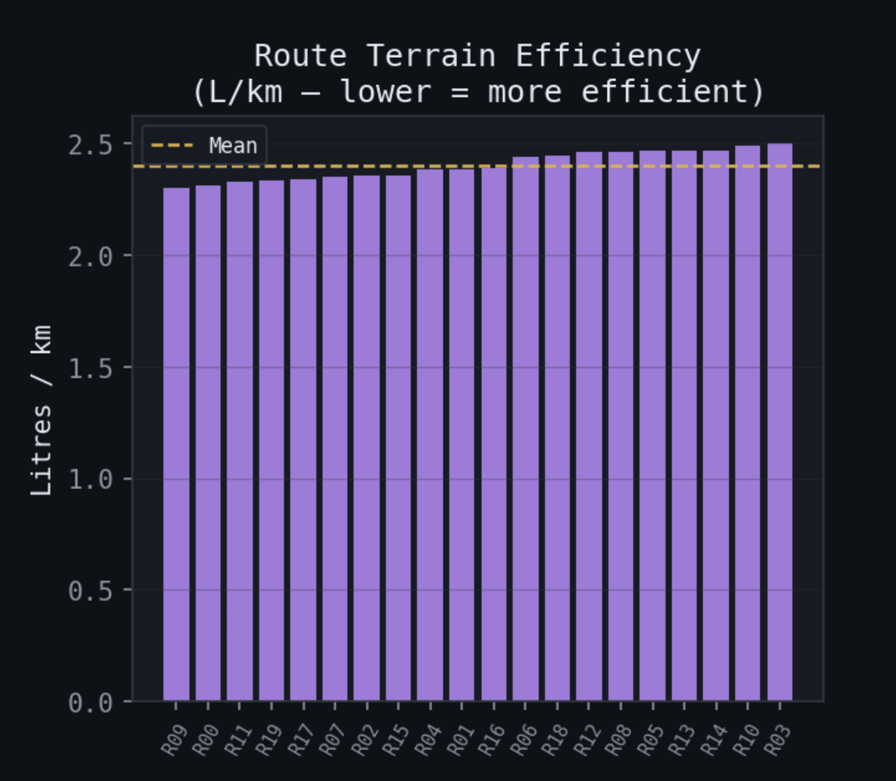
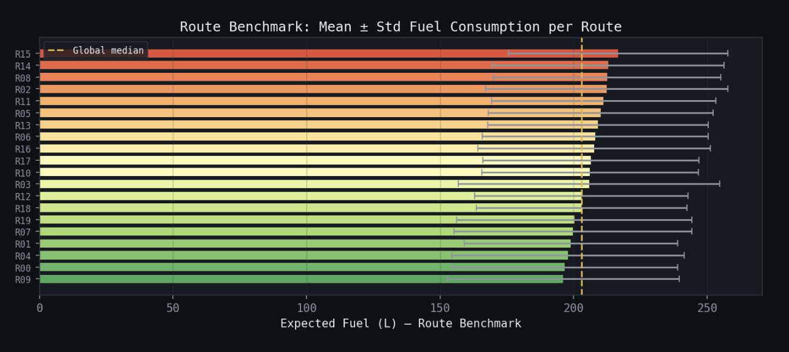
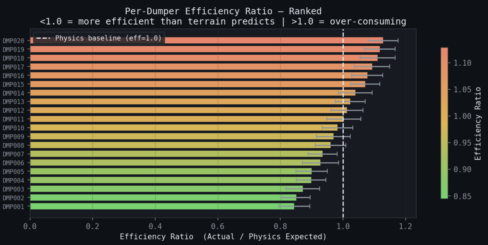
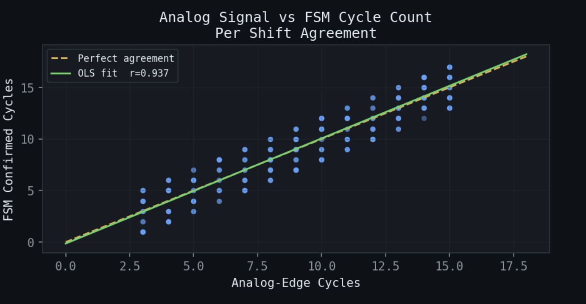
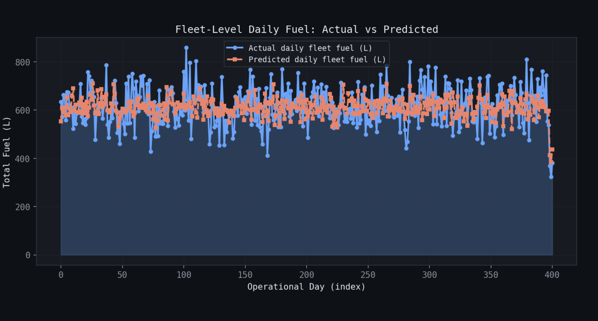
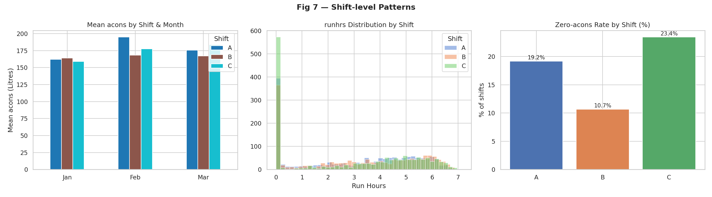
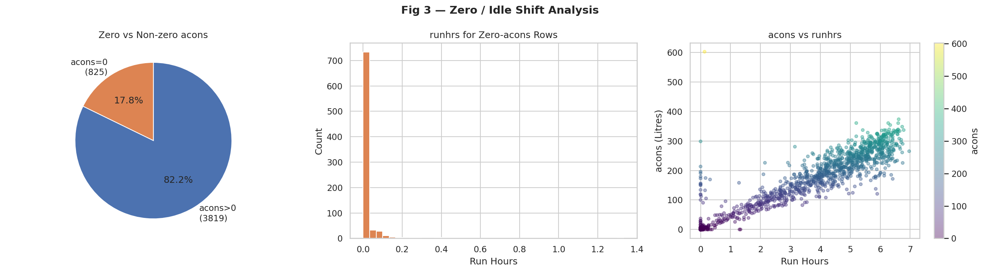

**TEAM NAME:** The Uchihas
**Team Members and Roll No.:** 
- Sabarishvar  MM24B046
- Sanjai       NA24B018
- Dhipak Kumar NA24B007
---
# **SUMMARY:**
- our solution predicts shift-level fuel consumption for mining dumpers by combining telemetry, spatial, and transactional data sources.
- we extract 3d terrain features from gpkg haul road geometry to compute actual grade and elevation profiles, use both analog dump switch signals and fsm-based cycle detection to count productive cycles per shift, and integrate rfid refuelling transactions as a direct fuel anchor.
- on top of this we build a route-level fuel benchmark using kmeans clustering on terrain features plus an ols physics model to estimate what a perfectly efficient dumper would burn on that route, and a dumper efficiency component that captures how each vehicle historically performs relative to that terrain baseline — together these separate what the route costs from what the dumper/operator costs, which is the core of the prediction.
# **PROBLEM UNDERSTANDING:**
- The goal is to predict the shift-wise fuel consumption (in litres) for mining dumpers to help reduce massive operating costs and emissions. 
- The primary challenge is having to mathematically infer physical "haul cycles" (the trip from load to dump) from raw telemetry data.
- This is especially tricky because the crucial "dump switch" ground-truth signal isn't fully available across the entire dataset.
- To win, the model must perfectly balance 3D terrain physics like road gradients and lift with unpredictable human operator behaviors.
# **DATASET OVERVIEW:**
## 1.
- the training data: 4,644 shift-level records across Jan (1,797), Feb (1,797), and Mar (1,050) 2026 — each month covering roughly the first 20 days
- test set: 1,735 rows (from id\_mapping\_new.csv)
- fleet: 75 trucks total across 2 mines (mine001: 46 trucks, mine002: 29 trucks); 32 unique trucks appear in the training summary files
- Shifts: Three per operational day — C, A, B (~1,549 each)
- Telemetry: High-frequency GPS/sensor parquet files, sampled at ~1 Hz per truck
## 2.
- Key Features Used
- Temporal: operational date, shift, day-of-week
- Fuel-level signals: initlev, endlev, arefill from summary; LLS sensor readings from telemetry for analog-computed consumption
- Activity: runhrs, FSM-detected haul cycles, analog dump event counts
- Terrain: 3D grade computed from GeoPackage XYZ (haul\_snap\_z), clipped at ±30% to suppress GPS artifacts
- Vibration: RMS and lateral/vertical IMU aggregations from axis_x/y/z
- Route clustering: KMeans cluster ID (fit on train+test combined) as a route-type proxy
- Per-dumper efficiency profile: static lookup merged from training data only (to avoid leakage)
## 3.
- acons has mean ~141 L, but 1,261 rows (27%) have acons < 10 L — most of which are idle/no-run shifts (825 zeros, 715 of those also have runhrs = 0). This heavily skews the distribution and warrants zero-filtering or separate treatment during validation.
- Target leakage trap: efficiency ratio features (acons\_vs\_route\_mean, acons\_efficiency\_ratio) needed to be strictly scoped to training data — a subtle but critical bug that caused near-zero test predictions before it was caught.
# **METHODOLOGY:**
## **DATA PREPROCESSING:**
- For the data processing the bigger picture which we tired out is that
- The math behind it is simple which is given below:
- <ins>**Xraw​(t)→Xclean​(t)→ϕ(X(t))→Xshift**</ins>
- **RAW PARQUET → CLEAN → TIME ALIGN → SPATIAL MAP → SIGNAL EXTRACTION → AGGREGATE → FEATURES**
- First as we have the raw data we will be cleaning it …. Data cleaning is the important step in this:
### **DATA CLEANING:**
#### **Missing Value Handling:**
$$x = \begin{cases} x & \text{if valid} \\ 0 & \text{if missing} \end{cases}$$

- This is ok here because:
  - speed = 0 → valid state
  - ignition = 0 → engine off
  - distance = 0 → no movement
#### **Interpolation:**
- This line in the code base: 
```python
df.groupby("vehicle")[coord].transform(lambda x: x.interpolate(limit=5))
```
- This is the one which helps in the interpolation process and the concept for this is just simple addition finding the variable xt   with the help of xt-1  and xt+1  which is this formula:
$$X_t = x_{t-1} + \frac{x_{t+1} - x_{t-1}}{2}$$
- This prevents short gaps and prevents fake and long gaps…
#### **Forward+Backward fill:**
- The basic concept here is that we are filling the NaNs here with this single concept:
$$X_t = X_{t-1}$$
- This concept is mainly used for the latitudes and longitudes
### **TIME PROCESSING:**
- Here we are using two concepts which are delta time and shift assignment:
- Delta time :  $$dt_i = t_i - t_{i-1}$$
- This is important because gps gets lost when $d_t > 120$ since it is for long gaps.
- And here we will be doing the shift assignment as well and in this the key point is that when its **22:00 it is considered as the next day**. And each shift is given below:

| Shift | Time  |
| ----- | ----- |
| A     | 6-14  |
| B     | 14-22 |
| C     | 22-6  |

- The formula which we will be using here is this:


$$op\_date = \begin{cases} date + 1 & \text{if hour} \geq 22 \\ date & \text{otherwise} \end{cases}$$


### **SPATIAL PROCESSING:**
- For coordinate transformation we have used **lat/lon** which is spherical and distance transformation needs cartesian
- And the second thing which we used is the code base is the **kd tree search cKDTree.query()**. We used this method because it is very fast for large spatial data.
- And some of the spatial features which we used like **dist_haul_m and dist_dump_m**.
### **SIGNAL PROCESSING:**
- In this method alone we tried to do something creative with the analog signals which is the **analog dump signals** ..  this is the line from the codebase: **analog_input_1 > 2.5**
- From this line we can see the thresholding is in the range of dump=1(x>2.5)  and the edge detection : edge=(xt​=1)∧(xt−1​=0)  and we have also included the detection of the event start.
- And there is an important concept FSM which we have used in the cycle segmentation process along with the analog signal dumps which we will address in the secondary outputs.
### **FEATURE AGGREGATION:**
- Aggregation is necessary because the model cant handle the time series directly so we need to convert it to fixed vectors first:

$$X_{shift} = \sum_{t \in shift} f(x_t)$$

- This is the generalised form but ther eare some terminologies which also we defined for this aggregation which are:
- **Sum features: from the codebase : run_hrs = sum(dt where ignition=1)**
- **Mean features from the codebase : speed_mean = mean(speed)**
- **Variance: from the codebase : speed_std**
- **ratios (idle_ratio = idle/run)**
- And we also **normalized** them across the shifts: cycle\_time = run\_hrs / cycles
### **FEATURE STABILITY:**
- The raw signals are noisy and they solution for this is to **aggregate them to reduce the noise**:

$$Var(\bar{x}) = \frac{\sigma^2}{n}$$

- Thus more the sample less the variance.
### **DATA LEAKAGE PREVENTION:**
- As far as the submission.csv is concerned we know we are calculating the y = acons(fuel_consumptions) and so the **leakage happens if there is a direct or indirect info about y in x**.
- **Direct leakage is : fuel_volume / fuel_drop_signal**
- This is considered as leakage because this ratio is fuel drop which is similar to the change in the quantity in the fuel tank and this is directly leaking the fuel consumption that is the acons.
- Another type of leakage can be from the **label derived leakage like vehicle_avg which is the mean(acons per vehicle)**
- And some hybrid leakage like **fuel_per_cycle_est** which has a direct formula of acons/cycle which also can be a cause for the leakage of the acons
- The fixes which we have induced to reduce such leakages are like:
- We used **RFID like rfid_litres,rfid_litres_lag1**
- **We use pure telemetry as well like run_hrs,dist_km,speed_mean** and we also added some event features and spatial features as well.
## **FEATURE ENGINEERING:**
- When it comes to the feature engineering part…. Here we have basically converting the raw telemetry time series $X(t)$ to a fixed-length feature vector per shift $X_{shift}$


$$\hat{y} = f(X_{shift})$$

- There are 6 core group of features which we are using in our codebase which are:
1. Activity features
2. Cycle / operational features
3. Spatial features
4. Motion + terrain features
5. Normalized / ratio features
6. Contextual features (vehicle, shift, fleet)
- Will go through each one by one:
### 1. ACTIVITY FEATURES:
$$run\_hrs = \sum dt_i \cdot 1(ignition = 1)$$
$$idle\_hrs = \sum dt_i \cdot 1(ignition = 1 \land speed < 2)$$
$$move\_hrs = \sum dt_i \cdot 1(speed \geq 2)$$
$$dist\_km = \sum \frac{disthav_i}{1000}$$

- And by all these features we can get one rough idea of the fuel that:
$$Fuel \approx \alpha \cdot run\_hrs + \beta \cdot dist\_km$$

- Where alpha and beta are some constants.
### 2. CYCLE FEATURES:
$$dump\_count = \sum 1(analog > threshold)$$
$$dump\_cycles = \sum 1(0 \rightarrow 1 \text{ transitions})$$
$$cycle\_time = \frac{run\_hrs}{dump\_cycles}$$
$$cycle\_dist = \frac{dist\_km}{dump\_cycles}$$
$$workload = dump\_cycles \cdot dist\_km$$

- By this we can tell an intuition like: 
$$Fuel \approx N_{cycles} \cdot Fuel_{per\_cycle}$$

### 3. SPATIAL FEATURES:
$$frac\_on\_haul = \frac{\sum 1(dist\_haul < 80)}{N}$$

- this is the haul\_distance\_mean
$$\frac{1}{N} \sum dist\_haul$$

- this is dump distance mean
$$\frac{1}{N} \sum dist\_dump$$

- From these features we can give a intuition of the fuel as: 
$$Fuel = f(\text{road quality}, \text{location})$$

### 4. **MOTION+TERRAIN FEATURES:**
- The four main features which are used in this category are: Cum\_climb\_m, Heading\_chg\_mean, alt\_mean, alt\_std, alt\_range, speed\_mean, speed\_std
- And each are explained one by one below: 
$$climb = \sum \max(0, altitude_i - altitude_{i-1})$$

#### 1. Cum\_climb\_m:
- The physics which we use here is simple which is the fuel is directly proportional to the climb and we know  $U = mgh$  so more the climb more the fuel will be utilised
$$heading = |angle_i - angle_{i-1}|$$

#### 2. Heading\_chg\_mean:
- The key concept here is more turns means more brakeage or acceleration which will eventually lead to the usage of more fuel.
$$mean = \frac{1}{n} \sum v_i$$
$$std = \sqrt{\frac{1}{n}(v_i - \mu)^2}$$

#### 3. speed\_mean, speed\_std:
- Here the concept is simple which is smooth driving means less fuel and more speed variance means usage of more fuel.
### 5. **RATIO/NORMALISED FEATURES:**
- The main key feature which we used in this category of feature is that: **Idle_ratio = idle_hrs/run_hrs**
- This removes scale dependencies like big truck vs small truck and long shift vs small shift.
### 6. **DAILY AGGREGATES:**
- `daily_dist_km`, `daily_run_hrs`
- The above two are the features used in the daily aggregates sector where the formula is given as:
- Daily = summation of the overall shifts of the day
- This captures all  the shifts in one summation which is overall workload intensity of the day.
### 7. **VEHICLE/FLEET FEATURES:**
- Tankcap - Fuel ≤ tankcap
- Dump\_switch -  its literally the analog input of the dump (given in fleet.csv either 1 or 0 but we use the input as 1), vehicle\_enc, mine\_enc, Shift\_enc
- All the encodings are given as vehicle→integer
### 8. **TEMPORAL FEATURES**:
- dow (day of week), shift
- The model which we added for this which is lightgbm automatically learns:Dist×cycles, run\_hrs×idle\_ratio

## **Modelling Approach:**
### 1. naive lightgbm with random k-fold
- first attempt was just a basic lightgbm with standard k-fold cross validation. raw features → lightgbm → acons.
- this failed because of time leakage. k-fold randomly splits data so future data ends up being used to predict the past, meaning the model indirectly learned "what will happen later"
- gave very low rmse locally (~173) but leaderboard rmse was way higher
- also loading full telemetry (~70M rows) directly caused memory issues
### 2. random forest
- tried random forest as a basic ensemble baseline. multiple trees → average → prediction.
- the core problem: no boosting means no correction of errors, and it cant extrapolate new patterns well
- when the test distribution shifted even slightly the model couldnt adapt. high rmse, not competitive
### 3. xgboost
- tried xgboost for better boosting performance, worked somewhat but failed because of high sensitivity to noisy data (gps drift, missing values) and difficult tuning
- small noise in features → large change in prediction → unstable predictions
### 4. lightgbm with leakage features
- early versions added features like `vehicle_avg` (mean fuel per vehicle), `shift_avg`, `fuel_per_cycle`
- these directly or indirectly used the target (acons) so mathematically: feature ≈ target
- result was very low cv rmse (fake performance) and very high lb rmse (~1500). the model just learned "predict average fuel" instead of learning actual behaviour
### 5. lag features (previous shift, rolling mean)
- tried using previous shift acons and rolling 3/7 shift averages. idea was past fuel → predict future fuel.
- failed because of data mismatch. in training the previous shift is available, in test the latest shift data is missing (10 shift gap). so the feature becomes invalid/stale and the model heavily relied on it → performance dropped
### 6. fuel sensor features (fuel_drop_sum)
- tried using fuel tank sensor readings: `fuel_drop = fuel_start - fuel_end`. looked very powerful because fuel_drop ≈ acons
- but the sensor was noisy and missing in test. model learned to depend on this feature and at test time when it was missing predictions collapsed
### 7. catboost + lightgbm blending
- combined lightgbm + catboost with a weighted average as the final prediction
- weights were tuned on validation (days 11-20) but test data was days 21-31 (different distribution)
- weights didnt generalise. no improvement over single model
### 8. full stacking (lgbm + xgb + rf)
- tried a two level stack: level 1 was lightgbm + xgboost + random forest, level 2 was a ridge model
- all models were tree-based so they learned the same patterns, noise got combined, and the dataset wasnt large enough to benefit from stacking
- instead of improving it added more error
### 9. cycle-level modelling
- tried predicting fuel per cycle then summing to shift level
- problem: if each cycle prediction has a small error, many cycles means large total error. also cycle detection from gps was noisy so the errors stacked up significantly
### 10. over-engineered features
- added too many features: operator encoding, vehicle behaviour stats, route id, dwell time etc
- too much redundancy. for example `dist_km`, `veh_dist_mean`, `dist_dev` are all saying roughly the same thing
- model got confused → overfitting
### 11. over-strict filtering
- tried keeping only perfect stationary fuel readings and removing low activity shifts to reduce noise
- reduced data size by ~90% so the model trained on very little data → poor generalisation
### 12. log target transformation mistake
- used `log(acons + 1)` as the target but forgot to properly reverse it with `expm1()` when generating predictions
- predictions became mathematically incorrect → very high rmse
### 13. spatial feature distribution mismatch
- used gpkg maps for spatial features but some mines had missing data which got filled with -1
- training had rich spatial info, test had missing spatial info → distribution mismatch between train and test features


- When it comes to the modelling part we used **LightGBM Regressor** for predicting the fuel consumption (acons).
- The main idea behind this model is that instead of predicting everything at once, it builds the prediction **step by step**.
- So the basic idea is:
$$Prediction = Tree_1 + Tree_2 + Tree_3 + ... + Tree_n$$
- Each tree is learning the **mistake of the previous one** and correcting it.
- Mathematically this can be written as:
$$
\hat{y}_i = \sum_{k=1}^{K} f_k(x_i)
$$
- Where:
- $f_k$  = decision tree  
- $x_i$  = input features  
- $\hat{y}_i$  = predicted fuel  
###  1. LOSS FUNCTION
- So our final output should be like predicted fuel approximately equal to the actual output.So we minimise the error between them using L2 loss (RMSE based).
- Mathematically:
$$
\mathcal{L} = \frac{1}{n} \sum_{i=1}^{n} (y_i - \hat{y}_i)^2
$$
### 2. GRADIENT BOOSTING CONCEPT
- Instead of directly minimising the loss, the model uses the concept of **gradient descent**.So at each step: New Tree learns the error of previous prediction
- Mathematically:
$$
g_i = \frac{\partial \mathcal{L}}{\partial \hat{y}_i}
$$
- Gradient descent tells in which direction we should go to maintain he minima of the contours..
### 3. SECOND ORDER OPTIMISATION (WHY LIGHTGBM IS FAST)
- LightGBM not only uses gradient but also uses **second derivative (Hessian)**
- Mathematically:
$$
h_i = \frac{\partial^2 \mathcal{L}}{\partial \hat{y}_i^2}
$$
- This helps in more faster converging 
### 4. TREE SPLITTING (HOW FEATURES ARE USED)
- At each node the model has to decide where to split the data  and It chooses the split which gives maximum gain.
- Mathematically:
$$
Gain = \frac{1}{2} \left( 
\frac{(\sum g_L)^2}{\sum h_L + \lambda} +
\frac{(\sum g_R)^2}{\sum h_R + \lambda} -
\frac{(\sum g)^2}{\sum h + \lambda}
\right) - \gamma
$$
- So the better the split the more reduced the error will be 
### 5. LEAF VALUE (FINAL OUTPUT PER NODE)
- Each leaf gives a prediction value which is:
$$
w_j = - \frac{\sum g_i}{\sum h_i + \lambda}
$$
- So each leaf is like the final correction added to the prediction 
### 6. LEARNING RATE (STEP CONTROL)
- Instead of adding full tree output we scale it:
$$
\hat{y}_i^{(t)} = \hat{y}_i^{(t-1)} + \eta \cdot f_t(x_i)
$$
- where:
- η = learning rate  
- This helps in the smooth learning process and avoids overfitting 
### 7. REGULARISATION (OVERFITTING CONTROL)
- To prevent the model from becoming too complex we use regularisation
- Mathematically:
$$
\Omega(f) = \gamma T + \frac{1}{2} \lambda \sum w_j^2
$$
- Where:
- $T$  = number of leaves  
- **_λ_**,**_γ_** = penalties  
- This ensures model generalises better 
### **8. INTUITION BEHIND THE MODEL:**
- The important intuition behind using this model is that it  handles non linearity smoothly 
- Fuel consumption is not linear: fuel ≠ just distance it only depends on the distance cycles terrain idle time. Some of the relations which this model can give is that:
- **dist × cycles**
- **run_hrs × idle_ratio**
- LightGBM can learn these automatically.

### **9. Automatic Feature Interaction:**
- We never explicitly gave:
- dist × cycles
- But the model learns this through tree splits.

### **10. Robust to Noisy Data**
- Tree models handle this better than linear models.

### **11. Works with Mixed Features**
- We have used these two- numerical features (dist, speed) ,categorical encoded (vehicle, mine, shift).LightGBM  can handles both easily.
- So this is the overview of the model which we used 
## **Validation Strategy:**
- For the validation strategy we just didnt use the normal k fold approach alone but we used a time based sequential validation for this because the data itself is a time based data only.
- In the normal k fold if we use: **Training and validation data are randomly split.**
- So  mathematically: **Train = random subset of D, Validation = remaining subset**
- But in our case the data is a time series of the following January to March to February so this is clearly sequential.
- So if we do a random split then the future data goes into the training and the past data goes into the validation so random split won't work here.
- So the model learns like $X_{past}$ gets predicted by the $X_{future}$
- But we need the Xpast  to predict the Xfuture  because the above one just pones us to the data leakage so k fold wont work here 
- To avoid the above problem we used the time based splitting where we divided the dataset into:
  - **FOLD 1:**
  - **Train → Jan (early) + March (till 11)**
  - **Validation → Jan (late)**
  
  
  - **Fold 2:**
  - **Train → Jan + Feb (early) + March (till 11)**
  - **Validation → Feb (late)**

- So the general idea here is to train the past to validate the future. This ensures there is on data leaks as the previous one. Mathematically this can be represented as:
$$Train = \{X_i \mid t_i \leq T\}$$
$$Validation = \{X_i \mid t_i > T\}$$

- We train on days 1–11 and we predict for days 21–31 so that there is always a time gap.
- We also used the **median** for the best iterations because in each fold we will be getting Best_iteration1 and Best_iteration2 . so instead of taking max or average we will be using the median because it **avoids extreme values and gives consistent model size**.
$$final_n = median(bestIterations)$$
# **SECONDARY OUTPUTS:**
## Route level fuel benchmarking:
- The core idea behind this is to: **“separate what the route costs from what the dumper/operator costs”**. If we manage to find the fuel consumed for a route independent of the vehicle traversing we could give a better estimate as to how much fuel was consumed as the vehicle took that route.
- The methodology for our codebase is as follows:
    1. Get the 3d points of the haul roads from the gpkg file 
    ```python
    try:
        haul_gdf = gpd.read_file(path, layer="haul_road")
        haul_xyz = layer_union_xyz(haul_gdf)           # the layer_union_xyz function calls the unary_union on all the haul road linestring geometries and then merges them all into one geometry
        haul_xy  = haul_xyz[:, :2] if len(haul_xyz) else np.zeros((0,2))
    ```
    2. the next process is to get every gps points near the haul road points which happens in the attach\_projected\_and_spatial() function. for an overview of the function it does the following:
       - first it converts the raw telemetry lat and long data into the projected coords using the **transformer** from the **pyproj** lib.
       - then it creates a dictionary called _spatial_ which looks like `spatial = {"mine_001": sp_obj, "mine_002": sp_obj}` where each of the sp_obj contains k-dimensional trees (for locating the haul roads nearby the points at that ts), mine boundaries and 3d points.
       - new cols required for final df are also added such as dist\_haul\_m, dist\_dump\_m, on\_haul\_ and a lot (refer the code !!!mention the line from the script!!!)
    3. now back to the `featurize_file_()` function, where we next compute the grade as per the gps points (grade here means steepness of the climb or the descent). also the grade is capped to 30% cause above that is gonna be unrealistic if you think about it. and then creates a col in df for the `haul_climb` and `haul_descent`.
    4. after creating the new cols for the dataframe we aggregate that to the main `agg_kw` dict like:
    ```python
    haul_cum_climb_m   = ("haul_climb",       "sum")
    haul_cum_descent_m = ("haul_descent",      "sum")
    haul_grade_abs_mean= ("haul_grade_pct",   lambda x: np.nanmean(np.abs(x)))
    haul_snap_z_mean   = ("haul_snap_z",      lambda x: np.nanmean(x))
    haul_snap_z_std    = ("haul_snap_z",      lambda x: np.nanstd(x))
    ```
    5. now one of the issues is that we dont have a col route but we do have the necessary data for building this.
    ```python
        ROUTE_FEATS = [
        "dump_dist_mean", "stock_dist_mean", "haul_dist_mean",
        "alt_mean", "cum_climb_m", "dist_km", "run_hrs",
        # New 3D terrain features — much richer route signal
        "haul_snap_z_mean",     # average elevation on haul road
        "haul_snap_z_std",      # elevation variability (hilly vs flat route)
        "haul_grade_abs_mean",  # average absolute grade (terrain difficulty)
        "haul_cum_climb_m",     # total climb on haul road (energy cost)
        "haul_cum_descent_m",   # total descent (regeneration potential)
        "bench_z_delta_mean",   # terrain adherence to bench contours
    ]
    ```
    this is for the cluster formation for the routes using the previously found data.
    refer this line for more info!!!!!
    and eventually after this clustering of the route leads to a df having every shift row in both train and test a `route_enc` col which ranges from 0 to 19 because of how KMeans works !!!! explain more about this too 
    
    6. physics benchmarking: instead of the approach of simple averaging we use ols (ordinary least squares). this answers the question of "If a perfectly efficient dumper ran this exact shift — no idling, no aggressive driving, no mechanical inefficiency then how much fuel would the terrain itself demand?" this is the purely physics problem and we use the following data:
        - dist_km which would be a function of the rolling resistance and also relates the fuel consumed.
        - haul\_cum\_climb_m: work done against gravity (computed from the 3d gpkg elevation data for each ts to each gps point.)
        - haul\_net\_lift_pos: this is irrecoverable energy ie. the energy spent climbing 80m is all burned as fuel. but the net positive lift assuming 20m represents the route's permanent elevation gain across the shift which is energy that had to be spent and could never come back even in theory.
    
    7. route benchmark table: `build_route_benchmarks()` function represents combining all of the data from the above steps.


## Dumper Efficiency Component:
- route benchmarking tells us what a route should cost. this component answers the next question - given that, how does a specific dumper/operator actually perform on it? two dumpers on the exact same route can burn very different amounts of fuel and that gap has nothing to do with terrain. its engine wear, tyre condition, driving style, idling behaviour etc.
- there are three layers to capturing this:
### physics normalised efficiency ratio
- we already have `physics_acons_expected` from the OLS model. dividing actual fuel by that gives a per shift ratio:
```python
df_train["acons_efficiency_ratio"] = (
    df_train["acons"] / (df_train["physics_acons_expected"] + 1e-6)
).clip(0.1, 5.0)
```
- `1.0` = perfectly efficient, `1.3` = 30% excess. clipped at 0.1-5.0 to suppress outliers from bad gps. because this divides out terrain difficulty, a dumper on a hard route and one on a flat route are actually comparable now.
- this then gets aggregated per vehicle:
```python
veh_eff = (
    df_train.groupby("vehicle")
    .agg(
        dumper_mean_efficiency=("acons_efficiency_ratio", "mean"),
        dumper_std_efficiency=("acons_efficiency_ratio", "std"),
    )
    .reset_index()
)
df_train = df_train.merge(veh_eff, on="vehicle", how="left")
te_feats = te_feats.merge(veh_eff, on="vehicle", how="left")
```
- `dumper_mean_efficiency` is the cleanest dumper quality signal we have - historical terrain-normalised excess across all training shifts. `dumper_std_efficiency` captures consistency - high std usually means multiple operators sharing the vehicle. unseen test vehicles just get the fleet wide average as fallback.
- note - `acons_efficiency_ratio` itself is not in feat_cols since it requires the actual fuel value (target leakage). only the historical per vehicle averages go in.
---
### behavioural profile (`build_dumper_profile`)
- the ratio captures the outcome. this captures the causes - what does this dumper actually do in its telemetry day to day.
```python
for col, mean_name, std_name in [
    ("dist_km",        "dumper_mean_dist_km",    "dumper_std_dist_km"),
    ("run_hrs",        "dumper_mean_run_hrs",     "dumper_std_run_hrs"),
    ("move_hrs",       "dumper_mean_move_hrs",    None),
    ("idle_ratio",     "dumper_mean_idle_ratio",  "dumper_std_idle_ratio"),
    ("dump_events",    "dumper_mean_dump_events", "dumper_std_dump_events"),
    ("fsm_dump_cycles","dumper_mean_fsm_cycles",  "dumper_std_fsm_cycles"),
    ("frac_on_haul",   "dumper_mean_frac_haul",   None),
]:
```
- `dumper_mean_idle_ratio` - probably the most direct inefficiency signal. consistently at 0.35 means 35% of engine on time is just burning fuel doing nothing
- `dumper_mean_dump_events` - avg cycles per shift from analog signal. fewer cycles than fleet peers = slower operation or excessive queuing
- `dumper_mean_frac_haul` - fraction of time on haul road. less = more time in loading queues or non productive zones
- `dumper_train_shifts` - how many training shifts this vehicle has, low count = noisy profile
- vehicles with no training history get fleet wide averages from `global_fallback`.
---
### shift vs dumper deltas (`attach_dumper_variation`)
- knowing a dumpers average is good. knowing how today compares to *that dumpers own average* is better - it separates whether this is a persistently bad vehicle or just a bad day for a normally fine one.
```python
pairs = [
    ("dist_km",        "dumper_mean_dist_km",    "dist_vs_dumper_mean"),
    ("run_hrs",        "dumper_mean_run_hrs",     "run_hrs_vs_dumper_mean"),
    ("idle_ratio",     "dumper_mean_idle_ratio",  "idle_ratio_vs_dumper_mean"),
    ("dump_events",    "dumper_mean_dump_events", "dump_events_vs_dumper_mean"),
    ("fsm_dump_cycles","dumper_mean_fsm_cycles",  "fsm_cycles_vs_dumper_mean"),
    ("move_hrs",       "dumper_mean_move_hrs",    "move_hrs_vs_dumper_mean"),
    ("frac_on_haul",   "dumper_mean_frac_haul",   "frac_haul_vs_dumper_mean"),
]
for col, mean_col, delta_col in pairs:
    if mean_col in out.columns and col in out.columns:
        out[delta_col] = out[col] - out[mean_col]
```
- delta = current shift value minus this vehicles historical average. so `idle_ratio_vs_dumper_mean = +0.15` means idling 15 points above its own norm today - something happened. `dump_events_vs_dumper_mean = -3` means 3 fewer cycles than usual - less productive work per litre that shift.
- all of these are valid at test time since they only need current telemetry + the training-computed averages.
- also computed here:
```python
out["dist_per_tankcap"] = out["dist_km"].astype(float) / (tc + 1e-6)
```
- normalises distance by tank capacity from fleet.csv - helps the model account for vehicle size differences across the fleet.



## Cycle Segmentation Methodology
- the problem here is pretty straightforward - we need to know when a dump actually happened. a haul cycle is Load → Travel → Dump, and counting those cycles per shift is one of the most direct fuel-relevant signals we have. more cycles = more productive work done.
- we have two approaches for this depending on what data is available for that vehicle, and they both run on every shift - the model then gets both signals and decides which to trust.
---
### Approach 1 - analog dump switch signal (March onwards)
- the hardware dump switch fires `analog_input_1 > 2.5` when material is discharged. available from march 1st onward for select dumpers only.
- two features come out of this:
```python
analog = pd.to_numeric(df["analog_input_1"], errors="coerce").fillna(0.0)
df["dump_analog_high"] = (analog > ANALOG_DUMP_THRESH).astype(np.float64)
analog_high = df["dump_analog_high"].values
prev_high = np.concatenate([[0.0], analog_high[:-1]])
same_veh = np.concatenate([[False], df["vehicle"].values[1:] == df["vehicle"].values[:-1]])
df["dump_analog_edge"] = ((analog_high > 0.5) & (prev_high < 0.5) & same_veh).astype(np.float64)
```
- `dump_analog_high` - total rows where signal is high (raw count of high signal duration)
- `dump_analog_edge` - rising edge only, i.e the 0→1 transition. this is the actual dump event count, not the sustained signal. `same_veh` makes sure we dont count a rising edge at the boundary between two different vehicles in the sorted dataframe
- `has_dump_signal = (dump_events > 0)` - flag that tells the model whether the analog signal is even present for this shift
---
### Approach 2 - FSM cycle detection (fallback for Jan/Feb and no-switch vehicles)
- for the historical data where the analog switch wasnt available we infer dump visits from GPS geometry + kinematics. this is the finite state machine approach.
- the FSM uses distance to the `ob_dump` layer (from GPKG) + speed + ignition to determine whether a dumper is inside a dump zone and has dwelled long enough to count as a real dump visit.
- constants controlling the FSM behaviour:
```python
FSM_DUMP_ENTER_M = 32.0    # enter dump corridor when within 32m of ob_dump layer
FSM_DUMP_EXIT_M = 52.0     # exit only when beyond 52m (hysteresis, prevents flickering)
FSM_DUMP_SLOW_MAX_KPH = 4.0  # must be moving slower than 4kph to count as dwelling
FSM_DUMP_MIN_DWELL_S = 40.0  # must dwell for at least 40s to qualify as a real dump
```
- the hysteresis gap (32m enter, 52m exit) is intentional - without it a vehicle hovering at the boundary would flicker in and out of the zone on every GPS ping and generate false cycles.
- the core FSM loop runs row by row in time order per vehicle:
```python
for i in range(n):
    di = dist_dump_m[i]
    if np.isfinite(di):
        if not inside and di <= enter_m:
            inside = True
        elif inside and di > exit_m:
            inside = False
    if prev_inside and not inside:
        if qualified:
            cycle_complete_edge[i] = 1.0
        qualified = False
        dwell = 0.0
    if inside and not prev_inside:
        dwell = 0.0
        qualified = False
        geom_enter[i] = 1.0
        if i > 0 and on_haul[i - 1] > 0.5:
            haul_to_dump_arrival[i] = 1.0
    slow = (speed_kph[i] < slow_max_kph) and (ignition[i] >= 0.5)
    if inside:
        if slow:
            dwell += dt_s[i]
            dwell_dt[i] = dt_s[i]
        if dwell >= min_dwell_s:
            qualified = True
    if inside and qualified:
        dump_qualified[i] = 1.0
    prev_inside = inside
```
- states the FSM tracks: outside zone / inside zone / qualified (dwelled long enough). a cycle is only counted (`cycle_complete_edge = 1`) when the vehicle exits after having qualified - not just any exit.
- `haul_to_dump_arrival` fires when the vehicle enters the dump zone from a haul road point - i.e it actually came from the haul road, not from a workshop or parking area. this filters out false entries.
- `apply_fsm_dump_features` runs this per contiguous vehicle block in the sorted dataframe:
```python
while start < n:
    v = veh[start]
    end = start + 1
    while end < n and veh[end] == v:
        end += 1
    sl = slice(start, end)
    ce, ddt, g, h, q = fsm_dump_visit_arrays(dist[sl], spd[sl], ign[sl], dt[sl], haul[sl])
    cyc[sl]=ce; dw[sl]=ddt; ge[sl]=g; ha[sl]=h; dq[sl]=q
    start = end
```
---
### aggregation to shift level
- both approaches produce per-row signals that then get aggregated into the `agg_kw` dict:
```python
dump_count=("dump_analog_high","sum"),
dump_events=("dump_analog_edge","sum"),
fsm_dump_cycles=("fsm_dump_cycle_edge","sum"),
fsm_dump_dwell_hrs=("fsm_dump_dwell_dt", lambda x: x.sum()/3600),
fsm_enter_dump_geom=("fsm_dump_geom_enter","sum"),
fsm_arrival_haul_dump=("fsm_haul_to_dump_arrival","sum"),
frac_fsm_dump_qualified=("fsm_dump_qualified","mean"),
near_dump_slow_frac=("near_dump_slow","mean"),
```
- `fsm_dump_dwell_hrs` - total hours spent slow inside dump zone. directly related to loading/unloading time per shift.
- `frac_fsm_dump_qualified` - fraction of time inside dump zone after qualifying. high = long dwell times relative to total dump zone time.
- `near_dump_slow_frac` - fraction of all GPS pings that are slow AND near dump zone. a softer spatial proxy that doesnt require the full FSM qualification.
---
### how the two approaches interact in the model
- `has_dump_signal` tells the model which signal is trustworthy for a given shift. when its 1, analog edge count (`dump_events`) is the reliable cycle count. when its 0 (jan/feb or no-switch vehicle), the FSM cycles take over.
- both sets of features go into feat_cols so the model can learn to weight them appropriately based on context rather than us hardcoding the logic.
- the per-vehicle efficiency in the dumper efficiency component also uses `dumper_mean_dump_events` and `dumper_mean_fsm_cycles` separately, so the model can track historical cycle rates per vehicle using whichever signal was available during training.


## Daily fuel consistency:
- the competition requires that aggregated predicted fuel aligns with actual daily fuel consumption per dumper. so its not just about getting individual shift predictions right - when you sum up all three shifts for a dumper on a given operational day the total should make sense against what was actually fuelled.
- our approach to ensuring this works at three levels: features that carry daily context into each shift prediction, a tankcap cap on predictions, and a fallback chain for shifts with missing telemetry.
---
### daily rollup features (`merge_daily_rollups`)
- the simplest and most direct thing - for each vehicle and operational day, sum up distance and run hours across all shifts and attach that back to every individual shift row:
```python
def merge_daily_rollups(shift_df):
    daily = shift_df.groupby(["vehicle","op_date"], sort=False).agg(
        daily_dist_km=("dist_km","sum"), daily_run_hrs=("run_hrs","sum")
    ).reset_index()
    return shift_df.merge(daily, on=["vehicle","op_date"], how="left")
```
- `daily_dist_km` and `daily_run_hrs` go into feat_cols directly. so when the model is predicting shift B fuel, it also sees how much distance and runtime the same vehicle already accumulated across shifts A and C that day. this gives the model daily-level context on every individual shift prediction.
- this is done for both train and test:
```python
tr_feats = merge_daily_rollups(tr_feats)
te_feats = merge_daily_rollups(te_feats)
```
---
### RFID as a daily fuel anchor
- the RFID refuelling transactions are the most direct daily consistency signal we have. actual litres pumped into the vehicle per shift, straight from the bowser:
```python
rfid_shift = (
    rfid.groupby(["vehicle", "date_dpr", "shift_dpr"])
    .agg(
        rfid_litres=("litres", "sum"),
        rfid_n_refuels=("litres", "count"),
        rfid_max_fill=("litres", "max"),
    )
    .reset_index()
)
```
- `rfid_litres` is the total fuel actually dispensed for that vehicle on that shift. when available its basically telling the model what the answer should be in the ballpark of. `rfid_litres_lag1` is the previous shifts refuel - useful because fuel consumption patterns are autocorrelated, a vehicle that refuelled heavily last shift was probably running hard.
- `rfid_max_fill` tells you how empty the tank got. a large single fill means the tank was nearly drained which implies high consumption on the prior shift.
- coverage note - RFID data only goes to feb 28. so march test shifts get `rfid_litres = NaN → -1` after fillna. the model learns to rely more on the terrain and efficiency features when rfid is missing.
---
### tankcap cap on predictions
- a sanity check to prevent physically impossible predictions. no vehicle can burn more fuel than its tank holds in one shift:
```python
cap = te_feats["tankcap"].astype(float).replace(0, np.nan)
pred_acons = np.where(np.isfinite(cap), np.minimum(pred_raw, cap.values*1.05), pred_raw)
```
- capped at `tankcap * 1.05` not exactly `tankcap` because the vehicle could have been refuelled mid-shift (which the rfid data shows does happen). the 5% headroom accounts for that without being too loose.
- `tankcap` comes from `fleet.csv` and is also in feat_cols directly, so the model already knows each vehicles tank capacity when making predictions.
---
### fallback chain for missing telemetry
- 34 rows in the final submission had no telemetry match at all (shifts in id_mapping_new that didnt have parquet data). rather than submitting zeros or the global median for all of them, we use a priority fallback:
```python
fallback_vs = df_train.groupby(["vehicle","shift"])["acons"].median().to_dict()
fallback_v = df_train.groupby("vehicle")["acons"].median().to_dict()
global_med = float(np.median(y_all))

sub["pred_acons"] = sub.apply(
    lambda r: r["pred_acons"] if pd.notna(r["pred_acons"])
    else fallback_vs.get((r["vehicle"],r["shift"]), fallback_v.get(r["vehicle"], global_med)),
    axis=1
)
```
- first tries `(vehicle, shift)` median - if this dumper has history on this specific shift type (A/B/C) use that
- falls back to vehicle-only median if the shift-specific combo doesnt exist
- global median only as last resort if the vehicle has no training history at all
- using median not mean here because fuel consumption distributions have a right skew - outlier high-consumption shifts would pull the mean up and make fallback predictions too high
- final clip to ensure nothing goes negative:
```python
sub["pred_acons"] = np.clip(sub["pred_acons"].astype(float), 0, None)
```
---
### operational day alignment
- one subtle thing worth mentioning - the operational day in this mine starts at 22:00 not midnight. shift C runs 22:00-06:00 and its timestamps technically fall on the calendar day before the operational day it belongs to. this is handled in `add_op_date_shift`:
```python
is_late = hour >= 22
op_date = ts.dt.normalize()
op_date = op_date.where(~is_late, op_date + pd.Timedelta(days=1))
```
- so a timestamp at 23:30 on Jan 5 gets assigned `op_date = Jan 6`. without this correction daily rollups would be wrong - shift C would be summed with the wrong set of shifts when computing `daily_dist_km` and `daily_run_hrs`, breaking the daily consistency features entirely.


# **KEY FINDINGS & INSIGHTS:**
## Correlation Matrix: 
- acons correlates most strongly with runhrs (r=0.95) — engine hours dominate fuel consumption. initlev (r=0.36) and arefill (r=0.30) show moderate correlations, reflecting fuel state management. lph is essentially uncorrelated with acons (r=0.05), reinforcing its unreliability as a standalone feature.

## Shift-level Patterns - Operational insight:
- February shows elevated consumption across all shifts (~190L vs ~163L in Jan). Shift C has the highest zero-acons rate (23.4%) vs Shift B (10.7%) — likely because Shift C straddles midnight (10pm–6am) and may include handover/idle time. This is important for shift-aware modeling.

## Zero / Idle Shift Analysis: 
- 17.8% of shifts (825 rows) have acons=0. Nearly all zero-acons rows have runhrs < 0.1, confirming these are genuine idle/non-operational shifts rather than data errors. The strong linear relationship between acons and runhrs in non-zero shifts (r=0.95, confirmed in correlation matrix image) validates run hours as the dominant predictor.

# **REFERENCES & TOOLS USED:**
1.⁠ ⁠*lightgbm*  
LightGBM is the core machine learning model we used, which builds multiple decision trees sequentially to capture complex non-linear relationships between driving behaviour and fuel consumption.

2.⁠ ⁠*scipy.stats (skew, kurtosis)*  
Used to measure how extreme or uneven the speed distribution is, helping us understand aggressive vs smooth driving patterns beyond just average speed.

3.⁠ ⁠*scipy.spatial.cKDTree*  
A fast nearest-neighbour search structure used to efficiently compute distances like distance to haul roads for millions of GPS points.

4.⁠ ⁠*sklearn.isotonic.IsotonicRegression*  
A calibration technique used to correct model bias by adjusting predictions in a monotonic way without assuming any fixed functional form.

5.⁠ ⁠*sklearn.cluster.KMeans*  
Used to group similar routes together by clustering load and dump locations, helping the model learn route-based fuel consumption patterns.

6.⁠ ⁠*pyproj.Transformer*  
Used to convert GPS coordinates from latitude/longitude into metric coordinates so that distance calculations are physically meaningful.

7.⁠ ⁠*shapely (contains_xy, unary_union)*  
Used for geometric operations like checking whether a vehicle is inside a mine boundary or haul road region based on spatial polygons.

8.⁠ ⁠*sklearn.preprocessing.StandardScaler*  
Used to normalize features so that models like Ridge regression in stacking do not get biased by feature scale differences.

9.⁠ ⁠*pandas (groupby, rolling, shift)*  
Used for handling time-series data by creating lag features, rolling statistics, and grouping vehicle-wise historical patterns.

10.⁠ ⁠*numpy (nanpercentile, polyfit, diff)*  
Used for numerical operations like extracting extreme values, fitting trends, and computing changes in signals such as acceleration.
# **CODEBASE:**
- github link: [link](https://www.github.com/dhipakkumar/ai_guild)
- collab link: [link](https://colab.research.google.com/drive/1sWcTSWJEyNN13Ky8nYVQEzuoPsO_gaFg) 
## things we tried but didnt implement them in the main code:

###  1.**Additional Idea Explored (Mode-Based Fallback Instead of Median):**

- One idea we considered was to use **mode instead of median** for fallback predictions in cases where telemetry data was missing.

- Currently, we use:

- **fallback = median(acons)**

- The reason median works well is because it is robust to extreme values.

- But the idea behind using mode was that:

- **Mode → most frequently occurring fuel value**

- So it might better represent the **most common operational pattern** of a vehicle instead of the central tendency.

- However, this approach was not used because fuel consumption is a **continuous variable**, and exact repeated values are rare.  
- This makes the mode unstable and often not meaningful, especially when values are spread out.

- So using median gave a more consistent and reliable fallback compared to mode.


### 2.
- We added a CatBoost Regressor to handle the high-cardinality categorical features (like vehicle IDs and shift codes) and ensembled it 50/50 with LightGBM.
- why it failed: The model became hypersensitive to noise. The models were getting destroyed by extreme outliers
### 3.
- LightGBM + CatBoost Blend + Lag Features
- Added fuel volume delta from the onboard sensor, cumulative climb, accelerometer std, heading change, and lag features (prev-shift acons, rolling 3/7 shift means). Stacked LGBM + CatBoost at 0.55/0.45 fixed blend.
- Why it failed (RMSE got worse): The lag features were the killer. They're built from smry where the previous shift is always 1 shift behind — but on the actual test set (days 21–31), the most recent smry data is 11 shifts stale. The model learned to rely on features that completely collapsed at inference time. Train-test distribution mismatch.
### 4.
- Dropped Lags, Added Physical Features + CatBoost Blend
- Removed lag features (learned from previous mistake). Added fuel\_drop_sum from the sensor, fixed cumulative climb, accelerometer std, heading change, day-of-month. Brought back CatBoost blend but now tuned blend weights per fold. Also introduced a zero-acons filter (dropped parked shifts from training).
- Why it failed (4544 → 5260 RMSE): Four compounding problems:
1. fuel\_drop\_sum was near-target leakage — it closely approximated acons during training but had patchy test coverage, so the model learned a feature that collapsed at inference
2. accel\_x/y/z_std was sparse → became NaN → filled with -1 → pure noise
