**TEAM NAME:** The uchihas
**Team Members and Roll No.:** 
- Sabarishvar  MM24B046
- Sanjai       NA24B018
- Dhipak Kumar NA24B007
---
# **SUMMARY:**
# **PROBLEM UNDERSTANDING:**
# **DATASET OVERVIEW:**
# **METHODOLOGY:**
## **DATA PREPROCESSING:**
- For the data processing the bigger picture which we tired out is that
- The math behind it is simple which is given below:
- <ins>**Xraw​(t)→Xclean​(t)→ϕ(X(t))→Xshift**</ins>
- **RAW PARQUET → CLEAN → TIME ALIGN → SPATIAL MAP → SIGNAL EXTRACTION → AGGREGATE → FEATURES**
- First as we have the raw data we will be cleaning it …. Data cleaning is the important step in this:
### **DATA CLEANING:**
#### **Missing Value Handling:**
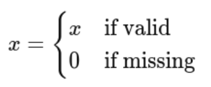
- This is ok here because:
  - speed = 0 → valid state
  - ignition = 0 → engine off
  - distance = 0 → no movement
#### **Interpolation:**
- This line in the code base: 
```python
df.groupby("vehicle")[coord].transform(lambda x: x.interpolate(limit=5))
```
- This is the one which helps in the interpolation process and the concept for this is just simple addition finding the variable xt   with the help of xt-1  and xt+1  which is this formula:
$$X_t = x_{t-1} + \frac{x_{t+1} - x_{t-1}}{2}$$
- This prevents short gaps and prevents fake and long gaps…
#### **Forward+Backward fill:**
- The basic concept here is that we are filling the NaNs here with this single concept:
$$X_t = X_{t-1}$$
- This concept is mainly used for the latitudes and longitudes
### **TIME PROCESSING:**
- Here we are using two concepts which are delta time and shift assignment:
- Delta time :  $$dt_i = t_i - t_{i-1}$$
- This is important because gps gets lost when $d_t > 120$ since it is for long gaps.
- And here we will be doing the shift assignment as well and in this the key point is that when its **22:00 it is considered as the next day**. And each shift is given below:
| Shift | Time  |
| A     | 6-14  |
| B     | 14-22 |
| C     | 22-6  |
- The formula which we will be using here is this:
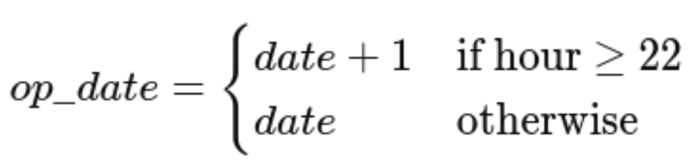
### **SPATIAL PROCESSING:**
- For coordinate transformation we have used **lat/lon** which is spherical and distance transformation needs cartesian
- And the second thing which we used is the code base is the **kd tree search cKDTree.query()**. We used this method because it is very fast for large spatial data.
- And some of the spatial features which we used like **dist_haul_m and dist_dump_m**.
### **SIGNAL PROCESSING:**
- In this method alone we tried to do something creative with the analog signals which is the **analog dump signals** ..  this is the line from the codebase: **analog_input_1 > 2.5**
- From this line we can see the thresholding is in the range of dump=1(x>2.5)  and the edge detection : edge=(xt​=1)∧(xt−1​=0)  and we have also included the detection of the event start.
- And there is an important concept FSM which we have used in the cycle segmentation process along with the analog signal dumps which we will address in the secondary outputs.
### **FEATURE AGGREGATION:**
- Aggregation is necessary because the model cant handle the time series directly so we need to convert it to fixed vectors first:
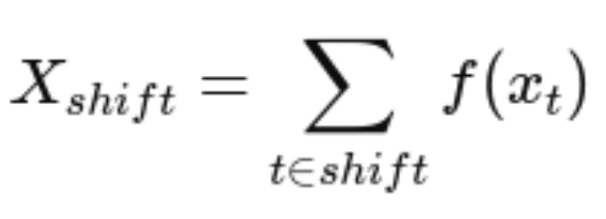
- This is the generalised form but ther eare some terminologies which also we defined for this aggregation which are:
- **Sum features: from the codebase : run_hrs = sum(dt where ignition=1)**
- **Mean features from the codebase : speed_mean = mean(speed)**
- **Variance: from the codebase : speed_std**
- **ratios (idle_ratio = idle/run)**
- And we also **normalized** them across the shifts: cycle\_time = run\_hrs / cycles
### **FEATURE STABILITY:**
- The raw signals are noisy and they solution for this is to **aggregate them to reduce the noise**:
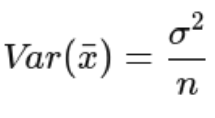
- Thus more the sample less the variance.
### **DATA LEAKAGE PREVENTION:**
- As far as the submission.csv is concerned we know we are calculating the y = acons(fuel_consumptions) and so the **leakage happens if there is a direct or indirect info about y in x**.
- **Direct leakage is : fuel_volume / fuel_drop_signal**
- This is considered as leakage because this ratio is fuel drop which is similar to the change in the quantity in the fuel tank and this is directly leaking the fuel consumption that is the acons.
- Another type of leakage can be from the **label derived leakage like vehicle_avg which is the mean(acons per vehicle)**
- And some hybrid leakage like **fuel_per_cycle_est** which has a direct formula of acons/cycle which also can be a cause for the leakage of the acons
- The fixes which we have induced to reduce such leakages are like:
- We used **RFID like rfid_litres,rfid_litres_lag1**
- **We use pure telemetry as well like run_hrs,dist_km,speed_mean** and we also added some event features and spatial features as well.
## **FEATURE ENGINEERING:**
- When it comes to the feature engineering part…. Here we have basically converting the raw telemetry time series $X(t)$ to a fixed-length feature vector per shift $X_shift$
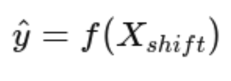
- There are 6 core group of features which we are using in our codebase which are:
1. Activity features
2. Cycle / operational features
3. Spatial features
4. Motion + terrain features
5. Normalized / ratio features
6. Contextual features (vehicle, shift, fleet)
- Will go through each one by one:
### 1. ACTIVITY FEATURES:
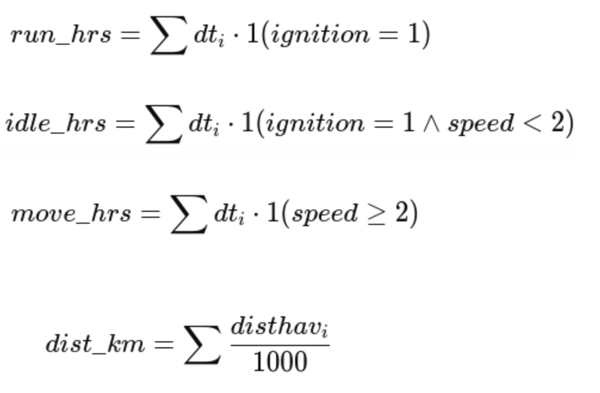
- And by all these features we can get one rough idea of the fuel that:
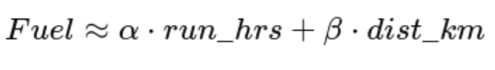
- Where alpha and beta are some constants.
### 2. CYCLE FEATURES:
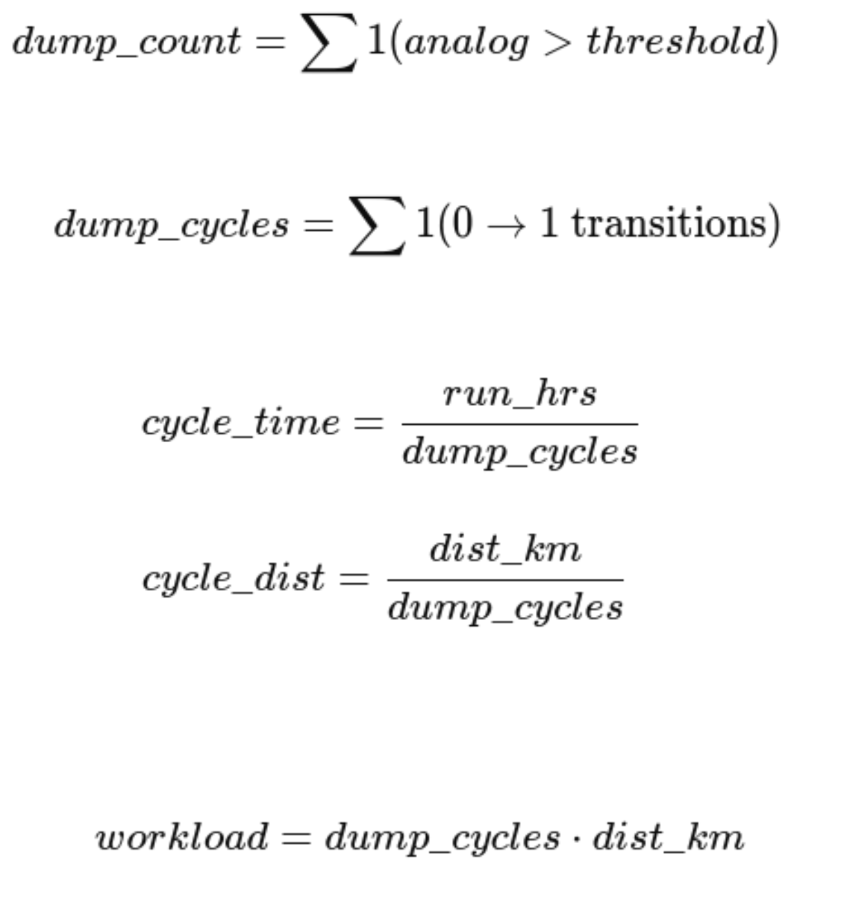
- By this we can tell an intuition like: 
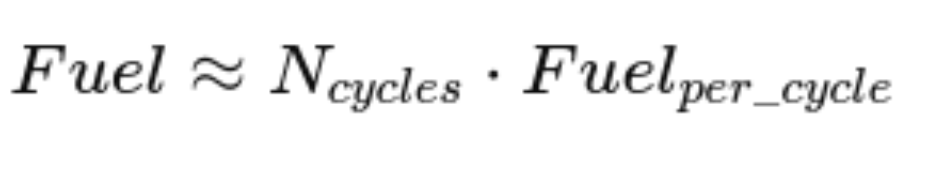
### 3. SPATIAL FEATURES:
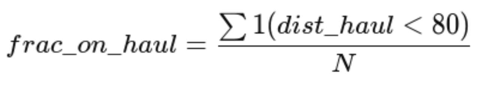
- this is the haul\_distance\_mean
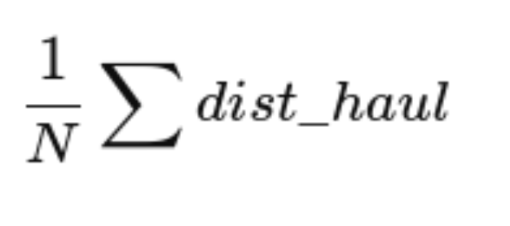
- this is dump distance mean
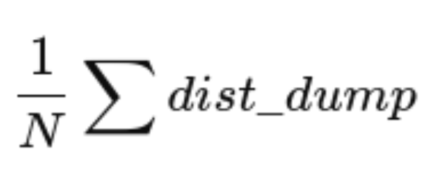
- From these features we can give a intuition of the fuel as: 
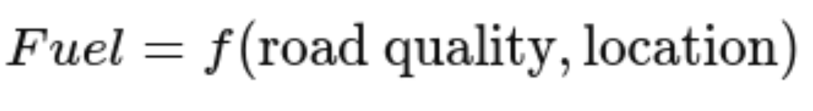
### 4. **MOTION+TERRAIN FEATURES:**
- The four main features which are used in this category are: Cum\_climb\_m, Heading\_chg\_mean, alt\_mean, alt\_std, alt\_range, speed\_mean, speed\_std
- And each are explained one by one below: 
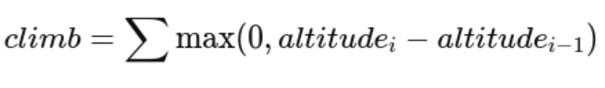
#### 1. Cum\_climb\_m:
- The physics which we use here is simple which is the fuel is directly proportional to the climb and we know  $U = mgh$  so more the climb more the fuel will be utilised
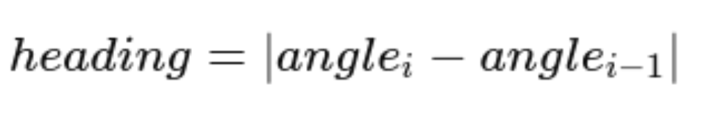
#### 2. Heading\_chg\_mean:
- The key concept here is more turns means more brakeage or acceleration which will eventually lead to the usage of more fuel.

#### 3. speed\_mean, speed\_std:
- Here the concept is simple which is smooth driving means less fuel and more speed variance means usage of more fuel.
### 5. **RATIO/NORMALISED FEATURES:**
- The main key feature which we used in this category of feature is that: **Idle_ratio = idle_hrs/run_hrs**
- This removes scale dependencies like big truck vs small truck and long shift vs small shift.
### 6. **DAILY AGGREGATES:**
- `daily_dist_km`, `daily_run_hrs`
- The above two are the features used in the daily aggregates sector where the formula is given as:
- Daily = summation of the overall shifts of the day
- This captures all  the shifts in one summation which is overall workload intensity of the day.
### 7. **VEHICLE/FLEET FEATURES:**
- Tankcap - Fuel ≤ tankcap
- Dump\_switch -  its literally the analog input of the dump (given in fleet.csv either 1 or 0 but we use the input as 1), vehicle\_enc, mine\_enc, Shift\_enc
- All the encodings are given as vehicle→integer
### 8. **TEMPORAL FEATURES**:
- dow (day of week), shift
- The model which we added for this which is lightgbm automatically learns:Dist×cycles, run\_hrs×idle\_ratio


# **SECONDARY OUTPUTS:**
## Route level fuel benchmarking:
- The core idea behind this is to: **“separate what the route costs from what the dumper/operator costs”**. If we manage to find the fuel consumed for a route independent of the vehicle traversing we could give a better estimate as to how much fuel was consumed as the vehicle took that route.
- The methodology for our codebase is as follows:
    1. Get the 3d points of the haul roads from the gpkg file 
    ```python
    try:
        haul_gdf = gpd.read_file(path, layer="haul_road")
        haul_xyz = layer_union_xyz(haul_gdf)           # the layer_union_xyz function calls the unary_union on all the haul road linestring geometries and then merges them all into one geometry
        haul_xy  = haul_xyz[:, :2] if len(haul_xyz) else np.zeros((0,2))
    ```
    2. the next process is to get every gps points near the haul road points which happens in the attach\_projected\_and_spatial() function. for an overview of the function it does the following:
       - first it converts the raw telemetry lat and long data into the projected coords using the **transformer** from the **pyproj** lib.
       - then it creates a dictionary called _spatial_ which looks like `spatial = {"mine_001": sp_obj, "mine_002": sp_obj}` where each of the sp_obj contains k-dimensional trees (for locating the haul roads nearby the points at that ts), mine boundaries and 3d points.
       - new cols required for final df are also added such as dist\_haul\_m, dist\_dump\_m, on\_haul\_ and a lot (refer the code !!!mention the line from the script!!!)
    3. now back to the `featurize_file_()` function, where we next compute the grade as per the gps points (grade here means steepness of the climb or the descent). also the grade is capped to 30% cause above that is gonna be unrealistic if you think about it. and then creates a col in df for the `haul_climb` and `haul_descent`.
    4. after creating the new cols for the dataframe we aggregate that to the main `agg_kw` dict like:
    ```python
    haul_cum_climb_m   = ("haul_climb",       "sum")
    haul_cum_descent_m = ("haul_descent",      "sum")
    haul_grade_abs_mean= ("haul_grade_pct",   lambda x: np.nanmean(np.abs(x)))
    haul_snap_z_mean   = ("haul_snap_z",      lambda x: np.nanmean(x))
    haul_snap_z_std    = ("haul_snap_z",      lambda x: np.nanstd(x))
    ```
    5. now one of the issues is that we dont have a col route but we do have the necessary data for building this.
    ```python
        ROUTE_FEATS = [
        "dump_dist_mean", "stock_dist_mean", "haul_dist_mean",
        "alt_mean", "cum_climb_m", "dist_km", "run_hrs",
        # New 3D terrain features — much richer route signal
        "haul_snap_z_mean",     # average elevation on haul road
        "haul_snap_z_std",      # elevation variability (hilly vs flat route)
        "haul_grade_abs_mean",  # average absolute grade (terrain difficulty)
        "haul_cum_climb_m",     # total climb on haul road (energy cost)
        "haul_cum_descent_m",   # total descent (regeneration potential)
        "bench_z_delta_mean",   # terrain adherence to bench contours
    ]
    ```
    this is for the cluster formation for the routes using the previously found data.
    refer this line for more info!!!!!
    and eventually after this clustering of the route leads to a df having every shift row in both train and test a `route_enc` col which ranges from 0 to 19 because of how KMeans works !!!! explain more about this too 
    
    6. physics benchmarking: instead of the approach of simple averaging we use ols (ordinary least squares). this answers the question of "If a perfectly efficient dumper ran this exact shift — no idling, no aggressive driving, no mechanical inefficiency then how much fuel would the terrain itself demand?" this is the purely physics problem and we use the following data:
        - dist_km which would be a function of the rolling resistance and also relates the fuel consumed.
        - haul\_cum\_climb_m: work done against gravity (computed from the 3d gpkg elevation data for each ts to each gps point.)
        - haul\_net\_lift_pos: this is irrecoverable energy ie. the energy spent climbing 80m is all burned as fuel. but the net positive lift assuming 20m represents the route's permanent elevation gain across the shift which is energy that had to be spent and could never come back even in theory.
    
    7. route benchmark table: `build_route_benchmarks()` function represents combining all of the data from the above steps.
## Dumper Efficiency Component:
- route benchmarking tells us what a route should cost. this component answers the next question - given that, how does a specific dumper/operator actually perform on it? two dumpers on the exact same route can burn very different amounts of fuel and that gap has nothing to do with terrain. its engine wear, tyre condition, driving style, idling behaviour etc.
- there are three layers to capturing this:
### physics normalised efficiency ratio
- we already have `physics_acons_expected` from the OLS model. dividing actual fuel by that gives a per shift ratio:
```python
df_train["acons_efficiency_ratio"] = (
    df_train["acons"] / (df_train["physics_acons_expected"] + 1e-6)
).clip(0.1, 5.0)
```
- `1.0` = perfectly efficient, `1.3` = 30% excess. clipped at 0.1-5.0 to suppress outliers from bad gps. because this divides out terrain difficulty, a dumper on a hard route and one on a flat route are actually comparable now.
- this then gets aggregated per vehicle:
```python
veh_eff = (
    df_train.groupby("vehicle")
    .agg(
        dumper_mean_efficiency=("acons_efficiency_ratio", "mean"),
        dumper_std_efficiency=("acons_efficiency_ratio", "std"),
    )
    .reset_index()
)
df_train = df_train.merge(veh_eff, on="vehicle", how="left")
te_feats = te_feats.merge(veh_eff, on="vehicle", how="left")
```
- `dumper_mean_efficiency` is the cleanest dumper quality signal we have - historical terrain-normalised excess across all training shifts. `dumper_std_efficiency` captures consistency - high std usually means multiple operators sharing the vehicle. unseen test vehicles just get the fleet wide average as fallback.
- note - `acons_efficiency_ratio` itself is not in feat_cols since it requires the actual fuel value (target leakage). only the historical per vehicle averages go in.
---
### behavioural profile (`build_dumper_profile`)
- the ratio captures the outcome. this captures the causes - what does this dumper actually do in its telemetry day to day.
```python
for col, mean_name, std_name in [
    ("dist_km",        "dumper_mean_dist_km",    "dumper_std_dist_km"),
    ("run_hrs",        "dumper_mean_run_hrs",     "dumper_std_run_hrs"),
    ("move_hrs",       "dumper_mean_move_hrs",    None),
    ("idle_ratio",     "dumper_mean_idle_ratio",  "dumper_std_idle_ratio"),
    ("dump_events",    "dumper_mean_dump_events", "dumper_std_dump_events"),
    ("fsm_dump_cycles","dumper_mean_fsm_cycles",  "dumper_std_fsm_cycles"),
    ("frac_on_haul",   "dumper_mean_frac_haul",   None),
]:
```
- `dumper_mean_idle_ratio` - probably the most direct inefficiency signal. consistently at 0.35 means 35% of engine on time is just burning fuel doing nothing
- `dumper_mean_dump_events` - avg cycles per shift from analog signal. fewer cycles than fleet peers = slower operation or excessive queuing
- `dumper_mean_frac_haul` - fraction of time on haul road. less = more time in loading queues or non productive zones
- `dumper_train_shifts` - how many training shifts this vehicle has, low count = noisy profile
- vehicles with no training history get fleet wide averages from `global_fallback`.
---
### shift vs dumper deltas (`attach_dumper_variation`)
- knowing a dumpers average is good. knowing how today compares to *that dumpers own average* is better - it separates whether this is a persistently bad vehicle or just a bad day for a normally fine one.
```python
pairs = [
    ("dist_km",        "dumper_mean_dist_km",    "dist_vs_dumper_mean"),
    ("run_hrs",        "dumper_mean_run_hrs",     "run_hrs_vs_dumper_mean"),
    ("idle_ratio",     "dumper_mean_idle_ratio",  "idle_ratio_vs_dumper_mean"),
    ("dump_events",    "dumper_mean_dump_events", "dump_events_vs_dumper_mean"),
    ("fsm_dump_cycles","dumper_mean_fsm_cycles",  "fsm_cycles_vs_dumper_mean"),
    ("move_hrs",       "dumper_mean_move_hrs",    "move_hrs_vs_dumper_mean"),
    ("frac_on_haul",   "dumper_mean_frac_haul",   "frac_haul_vs_dumper_mean"),
]
for col, mean_col, delta_col in pairs:
    if mean_col in out.columns and col in out.columns:
        out[delta_col] = out[col] - out[mean_col]
```
- delta = current shift value minus this vehicles historical average. so `idle_ratio_vs_dumper_mean = +0.15` means idling 15 points above its own norm today - something happened. `dump_events_vs_dumper_mean = -3` means 3 fewer cycles than usual - less productive work per litre that shift.
- all of these are valid at test time since they only need current telemetry + the training-computed averages.
- also computed here:
```python
out["dist_per_tankcap"] = out["dist_km"].astype(float) / (tc + 1e-6)
```
- normalises distance by tank capacity from fleet.csv - helps the model account for vehicle size differences across the fleet.
## Cycle segmentation methodology:
## Daily fuel consistency:
# **KEY FINDINGS & INSIGHTS:**
# **REFERENCES & TOOLS USED:**
# **CODEBASE:**
