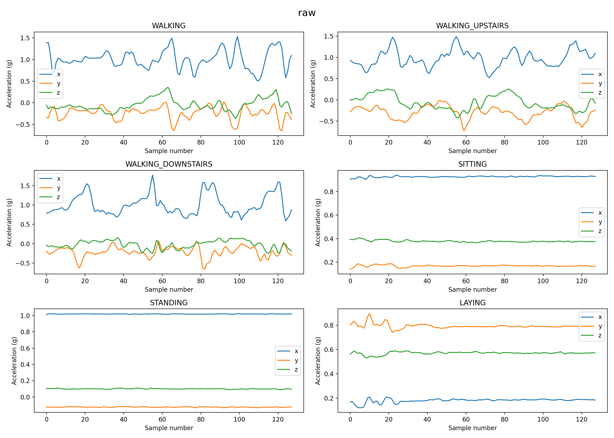

#+title: Notebook for task1
#+author: crypticwrath77
#+PROPERTY: header-args:python :python /Users/dkr/Desktop/clg/sem4/ai_guild/ai_guild_git/.venv/bin/python :session py :results output replace
* Checkpoint 1:
- just importing stuff that might be required...

#+begin_src python
from pathlib import Path
import pandas as pd
import matplotlib.pyplot as plt
DATA_DIR = Path("UCI_HAR_Dataset")
#+end_src

#+RESULTS:

#+begin_src python
activity_labels = pd.read_csv(
    DATA_DIR / "activity_labels.txt",
    sep=r"\s+",
    header=None,
    names=["id", "activity"]
)

y_train = pd.read_csv(
    DATA_DIR / "train" / "y_train.txt",
    header=None,
    names=["activity_id"]
)

acc_x = pd.read_csv(
    DATA_DIR / "train" / "Inertial Signals" / "total_acc_x_train.txt",
    sep=r"\s+",
    header=None
)

acc_y = pd.read_csv(
    DATA_DIR / "train" / "Inertial Signals" / "total_acc_y_train.txt",
    sep=r"\s+",
    header=None
)
acc_z = pd.read_csv(
    DATA_DIR / "train" / "Inertial Signals" / "total_acc_z_train.txt",
    sep=r"\s+",
    header=None
)
fig, axes = plt.subplots(3, 2, figsize=(14, 10))
axes = axes.ravel()

for i, row in activity_labels.iterrows():
    activity_id = row["id"]
    activity_name = row["activity"]

    idx = y_train[y_train["activity_id"] == activity_id].index[0]

    axes[i].plot(acc_x.iloc[idx], label="x")
    axes[i].plot(acc_y.iloc[idx], label="y")
    axes[i].plot(acc_z.iloc[idx], label="z")

    axes[i].set_title(activity_name)
    axes[i].set_xlabel("Sample number")
    axes[i].set_ylabel("Acceleration (g)")
    axes[i].legend()

plt.suptitle("raw", fontsize=16)
plt.tight_layout()
plt.savefig("raw_acc_window_per_activity.png", dpi=200)
plt.show()
#+end_src

